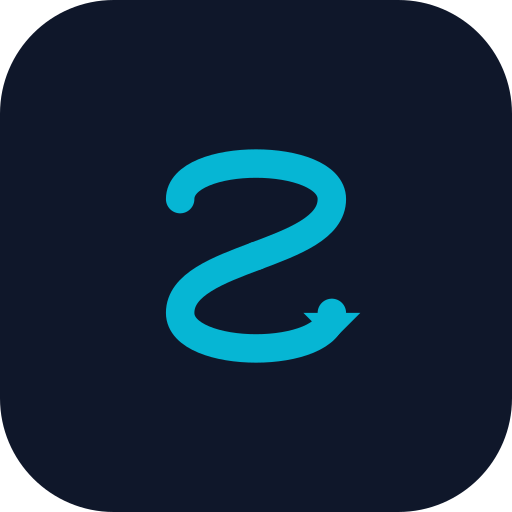

<p align="center">
  
</p>

# Sub Lazy 📱

[](./CHANGELOG.md)
[](https://kotlinlang.org/)
[](https://developer.android.com/)
[](https://developer.android.com/jetpack/compose)
[](https://developer.android.com/training/data-storage/room)

Have you ever looked at your bank statement and gone, *"Wait, when did I sign up for a premium cheese-of-the-month club?!"* only to realize you've been paying for it for the last two years? Or did you forget to cancel that "free trial" and paid the ultimate price? 

Yeah, we've all been there. 

**Sub Lazy** was born to save your wallet from your own forgetfulness! It is a premium, modern subscription tracker and manager for Android that helps you easily track recurring services, visualizes the monthly damage, and yells at you (nicely, via local notifications) 2 days before a bill renews so you actually have enough funds.

**Current release status (v0.0.10):** UI/UX Overhaul, Dynamic Semantic Colors, Component Modularity, Smooth Number Ticker Animations, and Tactile Haptic Feedback.

<p align="center">
  
  <br>
  <i>Me trying to track all my subscriptions... 🐱</i>
</p>

---

## ✨ Features

- **Quick Setup / Onboarding**: Start instantly by selecting from popular pre-defined subscription templates (Netflix, Spotify, YouTube Premium, Net/Wifi, etc.).
- **Smart Bill Ingestion**:
  - **Offline OCR Scanning**: Parse bill details (prices, billing cycles, renewal dates) locally and privately using **Google ML Kit Text Recognition** (no API key required).
  - **Notification Parsing**: Integrates a `BillNotificationListener` to capture SMS or banking app alerts (like MoMo, Vietcombank) and auto-prefill new subscriptions.
- **Interactive Dashboard**:
  - **Dynamic Spending Card**: Visualizes your total monthly subscription costs in a premium gradient card.
  - **Animated Charts**: Smooth "pop-in" animations for the Donut Chart and progressive "path-drawing" for the Forecasting line chart.
  - **Interactive Donut Chart**: Touch-responsive category spending donut chart. Tapping segments explodes (offsets) the segment and updates center details.
  - **Expanded Legends**: Tapping a category legend item expands a list showing all subscriptions tracked under that category with smooth slide animations.
  - **Billing Cycle Comparison**: Dynamic vertical bar charts comparing Weekly, Monthly, and Yearly spending impacts.
  - **Upcoming Renewals Timeline**: A scrollable horizontal timeline showing renewal dates. Urgently renewing items display a pulsing animated halo outer ring.
  - **Cashflow & Runway Forecasting**: A bespoke Canvas-drawn curve Line Chart projecting total subscription spending over the next 6 months, automatically highlighting and detailing the month with peak spending.
  - **Payment History feed**: Displays the last 5 manually/automatically completed billing events in a list on the Dashboard.
- **Real-World Commitments**: Track installments (SPayLater, Fundiin) and session-based memberships (Gym, Yoga with check-in buttons). Supports recurring vehicle or home maintenance scheduling.
- **Shared Subscriptions & Auto-Split VietQR**: Cost splitting (Netflix Family, Spotify Premium) with friends. Includes dynamic VietQR generation and a quick 1-tap system reminder action.
- **"Lazy Cat" Saving Gamification**: Canvas-drawn pet avatar reacting to budget health with animated expressions (HAPPY, SLEEPING, PANICKED).
- **Trial Sandbox**: In-app step-by-step cancellation walkthrough paths for major subscription platforms (Google Play, Apple Store, YouTube, Spotify, Netflix).
- **Smart Form Auto-Detection & Visual Icon Mapping**: Live mapping of descriptive Material icons based on title names (e.g. TV, headphones, vehicle, pets, tools) and automatic configuration of billing categories/cycles as the user types.
- **Manual Payment Tracking & VietQR Quick Pay**: Users can click "Mark as Paid" directly from the timeline card details. This records the payment in the database, rolls over the renewal date, and decrements remaining limits. For subscriptions with bank transfer details, the app automatically generates a standard Napas **VietQR** transfer code so users can scan and pay instantly.
- **Subscription List Screen**: Shows monthly equivalent costs, renewal schedules, color-coded countdown indicators, and a **remaining count badge** (e.g. `Còn 3 lần`) for limited subscriptions. Swift swipe-to-delete has a double-confirm dialog.
- **Add / Edit Subscriptions**: Fully customizable forms. Includes pricing, renewal date picker, category dropdown, billing cycle selection (**Daily**, **Weekly**, **Monthly**, **Every 3 Months**, **Every 6 Months**, **Yearly**, **One-time**), and a **currency toggle (VND/USD)** using Material 3 card controls.
- **Auto-Delete Limit (1-time / N-times count)**: Users can configure subscriptions to delete automatically after a set number of payments (1 time, custom N times, or unlimited). The app automatically rolls over renewal dates, decrements remaining cycles, or deletes expired subscriptions on startup.
- **Dynamic Localization & Multi-Currency**:
  - Instantly switch the app language between **English** and **Vietnamese** dynamically.
  - **Real-Time Currency Conversions**: All amounts are dynamically formatted and converted based on the active language (VND displayed in Vietnamese, USD displayed in English) using a real-time exchange rate of `1 USD = 25,400 VND` to prevent raw numerical discrepancies.
- **Billing Alerts (Notifications)**: Schedules background reminders using **Android WorkManager** exactly 2 days before renewal.
- **Data Backup & Google Drive Sync**: Export all your data safely to a local JSON file or sync it directly to your linked Google Drive account with 1-click in Settings.
- **Home Screen Widget**: A modern **Jetpack Glance** widget that displays your upcoming bills right on your launcher screen.

<p align="center">
  
  <br>
  <i>Current state of my bank account after subscription renewals... 💰</i>
</p>

---

## 🛠️ Architecture & Tech Stack

The project follows **Clean Architecture** with **MVVM** pattern and modern Android best practices:

- **UI Framework**: [Jetpack Compose](https://developer.android.com/jetpack/compose) — fully declarative, state-driven UI with Material Design 3.
- **Dependency Injection**: [Hilt (Dagger)](https://dagger.dev/hilt/) — constructor injection across ViewModels, Use Cases, and Repository.
- **Data Persistence**: [Room SQLite](https://developer.android.com/training/data-storage/room) — reactive Flow streams, typed enum converters, ForeignKey constraints with CASCADE.
- **Domain Layer**: Use Cases (`domain/usecase/`) encapsulate all business logic, keeping ViewModels thin.
- **Repository Pattern**: `ISubscriptionRepository` interface injected into ViewModels and Use Cases for testability.
- **Background Tasks**: [WorkManager](https://developer.android.com/topic/libraries/architecture/workmanager) — reliable notification scheduling surviving reboot and app termination.
- **Asynchronous Execution**: Kotlin **Coroutines** + **StateFlow** / **Flow** for lifecycle-aware reactive UI updates.
- **Navigation**: Type-safe Compose Navigation 2.8+ with `@Serializable` route contracts.
- **Design System**: Material Design 3 with custom HSL-based theming, system-adaptive light/dark mode, and edge-to-edge screens.

---

## 📂 Project Structure

```
lazy_sub/
├── app/
│   ├── build.gradle.kts                  # Subproject Gradle build file
│   ├── schemas/                          # Room DB exported schema files (v6–v9)
│   └── src/main/
│       ├── AndroidManifest.xml           # App configuration & permissions
│       └── java/com/gbao86/sub_lazy/
│           ├── MainActivity.kt           # App entry point (@AndroidEntryPoint)
│           ├── SubLazyApplication.kt     # @HiltAndroidApp + notification channel init
│           ├── data/                     # Room entities, DAOs, Repository, TypeConverters
│           │   ├── model/                # BillingCycle, SubscriptionCategory, SubscriptionCurrency enums
│           │   └── api/                  # GeminiService (offline ML Kit OCR)
│           ├── di/                       # Hilt AppModule — DB, DAO, Repository bindings
│           ├── domain/
│           │   └── usecase/              # Business logic use cases (7 use cases)
│           ├── ui/
│           │   ├── screens/              # Composable screens split by concern:
│           │   │   ├── DashboardScreen.kt            # Scaffold + tabs orchestrator
│           │   │   ├── DashboardSpendingCard.kt      # Hero gradient spending card
│           │   │   ├── DashboardLazyCat.kt           # Cat mascot + budget health
│           │   │   ├── DashboardDialogs.kt           # Budget sheet, Add sheet, Settings, Templates
│           │   │   ├── DashboardCharts.kt            # Donut + category legend
│           │   │   ├── DashboardInteractive.kt       # Interactive chart components
│           │   │   ├── DashboardForecastAndHistory.kt# Cashflow chart + payment history
│           │   │   ├── DashboardTimeline.kt          # Renewal timeline + shared members
│           │   │   ├── SubscriptionListScreen.kt     # List, search, swipe-delete
│           │   │   ├── AddEditSubscriptionScreen.kt  # Add/edit form
│           │   │   ├── AddEditComponents.kt          # Form sub-components
│           │   │   └── OnboardingScreen.kt           # First-launch template picker
│           │   ├── navigation/NavGraph.kt            # Type-safe @Serializable routes
│           │   ├── theme/                            # Color, Type, Theme
│           │   ├── CategoryUtils.kt                  # Icon + display name mapping
│           │   ├── CurrencyFormatter.kt              # VND/USD formatting + conversion
│           │   ├── DateUtils.kt                      # java.time date helpers
│           │   ├── FinanceCalculator.kt              # Monthly cost, runway, forecast
│           │   ├── ExchangeRateManager.kt            # Exchange rate (hardcoded fallback)
│           │   └── VietQRGenerator.kt                # Napas VietQR URL builder
│           ├── viewmodel/
│           │   ├── DashboardViewModel.kt             # Dashboard state + sharedMembersMap
│           │   ├── SubscriptionListViewModel.kt      # List CRUD
│           │   └── AddEditViewModel.kt               # Form state + SharedMember save
│           └── worker/
│               ├── BillNotificationListener.kt       # Banking notification parser
│               ├── NotificationScheduler.kt          # WorkManager scheduling helper
│               └── NotificationWorker.kt             # Renewal reminder worker
└── res/
    ├── values/strings.xml                # English string resources
    └── values-vi/strings.xml            # Vietnamese translations
```

---

## 🚀 Getting Started

### Prerequisites
- **Android Studio** (Ladybug or newer recommended)
- **Java SE Development Kit (JDK) 17 or 21**
- Android Device or Emulator running **API Level 26 (Android 8.0)** or higher

### 🔑 Google Sign-In Setup (Optional for Local Development)
Since Google Sign-In requires matching certificate fingerprints, to make it work locally:
1. Generate the SHA-1 fingerprint of your local Android debug keystore by running:
   ```bash
   ./gradlew signingReport
   ```
2. Create a Google Cloud Platform (GCP) project and register your SHA-1 fingerprint.
3. Create an **OAuth Web client ID** under *Credentials* in GCP.
4. Replace the Web Client ID string in [DashboardScreen.kt](file:///D:/App/lazy_sub/app/src/main/java/com/gbao86/sub_lazy/ui/screens/DashboardScreen.kt) at the `.requestIdToken(...)` call with your new client ID.

### Installation & Run

1. Clone or copy the project to your local directory.
2. Open the project in Android Studio.
3. Let Gradle sync project dependencies.
4. Run the app on an emulator or a physical device:
   ```bash
   ./gradlew.bat installDebug
   ```
---

## 🌍 Localization
To switch languages programmatically, use the Globe/Language icon on the top right corner of the Dashboard screen. Selecting a language automatically updates the context locale via the `AppCompatDelegate` API.

---

## 📜 Changelog

All notable changes and updates to this project are documented in the [CHANGELOG.md](./CHANGELOG.md) file.

---

## 👥 Author

*   **Trịnh Gia Bảo (gbao86)**
*   📧 Email: [tiktokthu10@gmail.com](mailto:tiktokthu10@gmail.com)

---

## 📄 License

This project is licensed under a Non-Commercial License. You are free to copy and modify the code for personal use, but commercial exploitation or monetization is strictly prohibited. See the [LICENSE](./LICENSE) file for details.

---

## 🔒 Security

For details on security practices, offline-first architectures, or reporting vulnerabilities, see the [Security Policy](./SECURITY.md).

